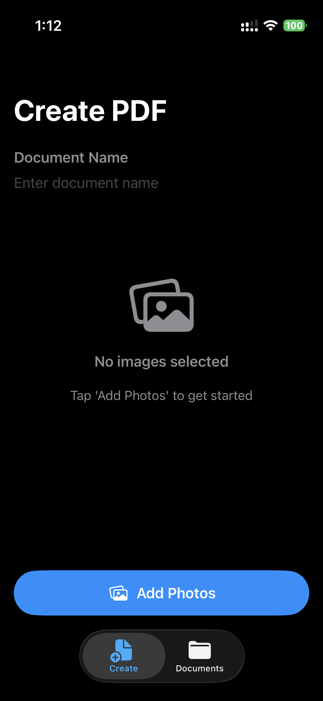
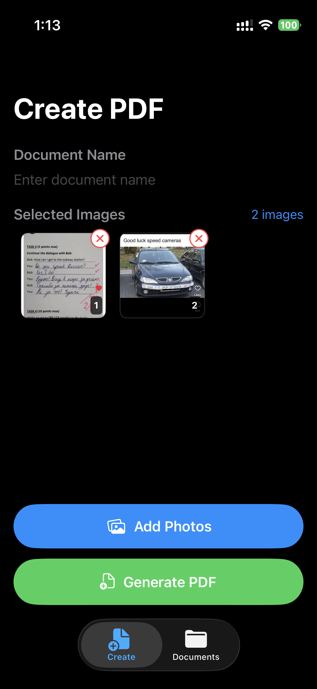
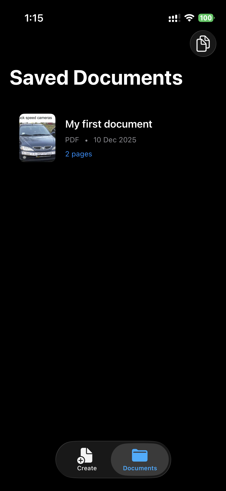

# PDF Converter App

## Description

iOS mobile application for converting images to PDF documents. Built with SwiftUI and MVVM architecture following iOS 15+ standards. Users can select photos from gallery, generate multi-page PDFs, manage saved documents, and merge multiple PDFs into one.

## Features

### Document Creation
<div align="center">
  
  
</div>

- Select multiple images from photo library
- Real-time preview grid with page ordering
- Custom document naming
- Convert images to PDF with compression (JPEG 0.7 quality)
- Navigate to PDF reader immediately after generation

### PDF Reader
<p align="center">
  
</p>

- Swipe-based page navigation
- Delete individual pages with confirmation
- Save document to CoreData
- Share via iOS Share Sheet
- Page counter display

### Saved Documents
<p align="center">
  
</p>

- List view of all saved PDFs
- Thumbnail preview with metadata (name, date, page count)
- Context menu actions: Share, Merge, Delete
- Merge mode: combine 2+ documents into single PDF

### User Interface
<div align="center">
  
</div>

- Welcome screen on first launch
- Tab-based navigation (Create / Documents)
- Loading overlays for async operations
- Empty state placeholders
- Keyboard dismissal on tap
- Dark mode compatible

## Technical Stack

- Language: Swift 5.9+
- UI Framework: SwiftUI
- Architecture: MVVM (Model-View-ViewModel)
- Persistence: CoreData
- PDF Operations: PDFKit
- Image Selection: PhotosUI (PHPicker)
- Concurrency: Structured Concurrency (async/await)
- Minimum iOS: 15.0

## Project Structure

```
My PDF/
├── App/
│   ├── My_PDFApp.swift          # App entry point
│   └── MainTabView.swift        # Tab navigation
│
├── Models/
│   ├── PDFDocument.swift        # Domain model
│   └── PDFPageModel.swift       # Page model
│
├── ViewModels/
│   ├── EditorViewModel.swift
│   ├── PDFReaderViewModel.swift
│   └── SavedDocumentsViewModel.swift
│
├── Views/
│   ├── WelcomeView.swift
│   ├── EditorView.swift
│   ├── PDFReaderView.swift
│   └── SavedDocuments/
│       ├── SavedDocumentsView.swift
│       └── DocumentCell.swift
│
├── Services/
│   ├── PDFKitManager.swift      # PDF operations
│   └── CoreDataManager.swift    # Persistence layer
│
├── CoreData/
│   ├── PDFDataModel.xcdatamodeld
│   └── Entities/                # Generated classes
│
├── Components/
│   ├── LoadingOverlay.swift
│   ├── ShareSheet.swift
│   └── PHPicker.swift
│
└── Helpers/
    └── Extensions/
        └── Collection+SafeAccess.swift
```

## Setup and Run

### Requirements
- Xcode 15+
- iOS 15.0+ deployment target

### Installation

1. Clone repository:
```bash
git clone https://github.com/yourusername/My-PDF.git
cd My-PDF
```

2. Open project in Xcode:
```bash
open "My PDF.xcodeproj"
```

3. Select target device (iPhone or Simulator)

4. Build and run: Command+R

### First Launch
App displays Welcome Screen with feature overview. Tap "Continue" to proceed to main app. Welcome screen is shown only once.

## Architecture

### MVVM Pattern

```
View (SwiftUI)
    ↕ Bindings (@Published)
ViewModel (ObservableObject)
    ↕ Method calls
Services (Managers)
    ↕ Data operations
Model (Struct) / CoreData
```

### Data Flow Example

1. User taps "Add Photos" → EditorView presents PHPicker
2. User selects images → EditorViewModel stores in @Published var selectedImages
3. User taps "Generate PDF" → EditorViewModel calls PDFKitManager.createPDF()
4. Generated PDFDocument → @Published var generatedPDF → triggers navigation
5. PDFReaderView displays result

### CoreData Schema

```
DocumentEntity
├── id: UUID
├── name: String
├── createdAt: Date
└── pages: [PageEntity] (cascade delete)

PageEntity
├── id: UUID
├── pageNumber: Int16
├── imageData: Data (external storage)
└── document: DocumentEntity
```
### License
MIT License
